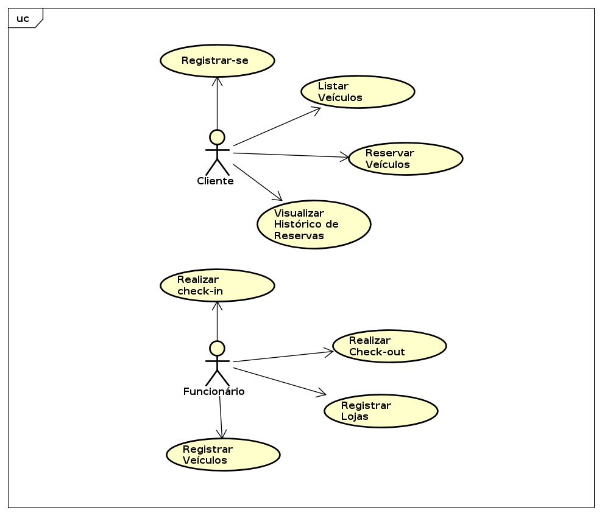
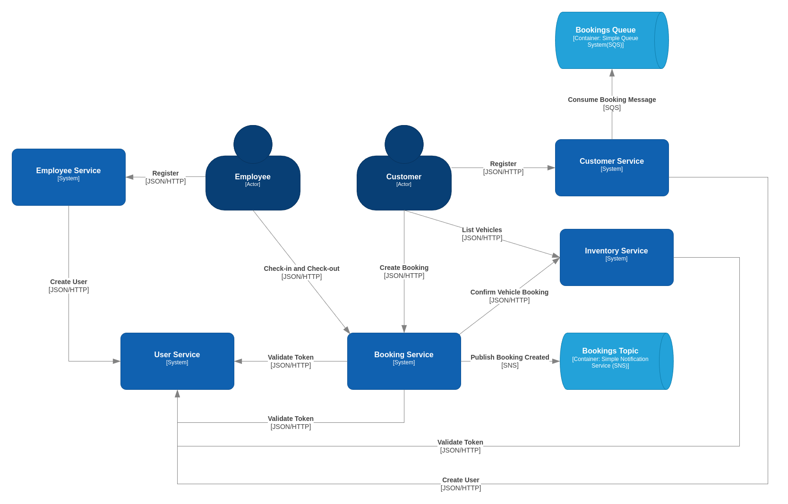

# Carro Facil
Esse é um estudo de caso para meu trabalho de conlucsão de curso no Instituto Federal Fluminense. É um sistema para uma locadora de veículos utilizando Microsserviços e Domain-Driven Design.

## Tecnologias
* Java 17
* DynamoDB
* Postgres
* SNS e SQS
* Terraform
* Gatling

## Contexto
O estudo de caso é realizado em uma empresa fictícia chamada **CarroFacil**. Essa empresa é uma locadora de veículos que atua em todo o território nacional. Ela possui uma frota de veículos própria e uma grande quantidade de clientes. Eles podem alugar veículos por períodos de tempo variados, desde horas até semanas. A CarroFacil possui um sistema de locação de veículos que foi desenvolvido há alguns anos e está apresentando problemas de escalabilidade, desempenho e manutenibilidade. Por esse motivo, a empresa decidiu desenvolver um novo sistema de locação de veículos utilizando microsserviços e DDD.

## Requisitos

## Arquitetura do Sistema

